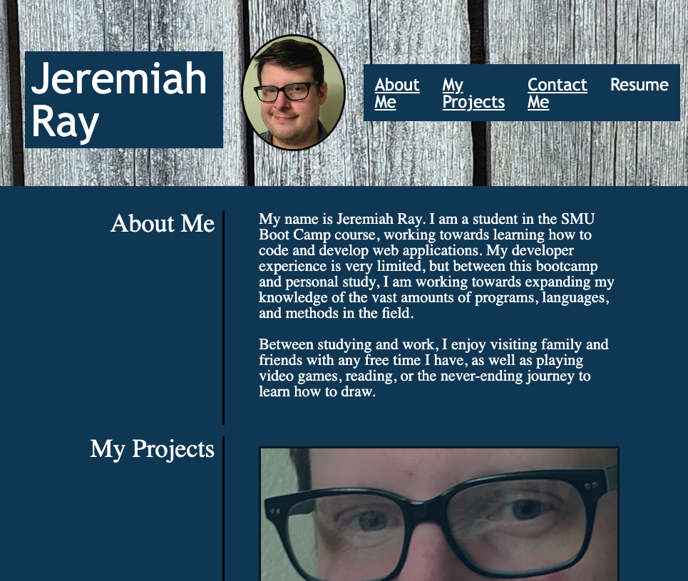

# Jeremiah Ray Portfolio

## **Table of Contents:**
1. Introduction
2. Link to Deployed Page
3. Styles Utilized
4. Webpage Sample

## **1.    Introduction**

The goal of this project was to set up a portfolio webpage for myself. The goal was to apply CSS stylings learned over the course of this lesson and apply them in a practical application. 

** **All the images used in this were created by Jeremiah Ray. Any unauthorized use of these images is not permitted.****
## **2.   Link to Deployed Page**

https://jeremydray.github.io/jeremiah-portfolio/

## **3.  Styles Utilized**

There were many different styles and techniques utilized in this project:
* Global Variables
* Flexbox Alignment
* Font-Families
* Pseudo-Classes (hovering applying different style)
* Pseudo-Elements (hovering for a tooltip)
* Media Queries and Responsive Design
* Typography Principles

## **4. Webpage Sample**

  

